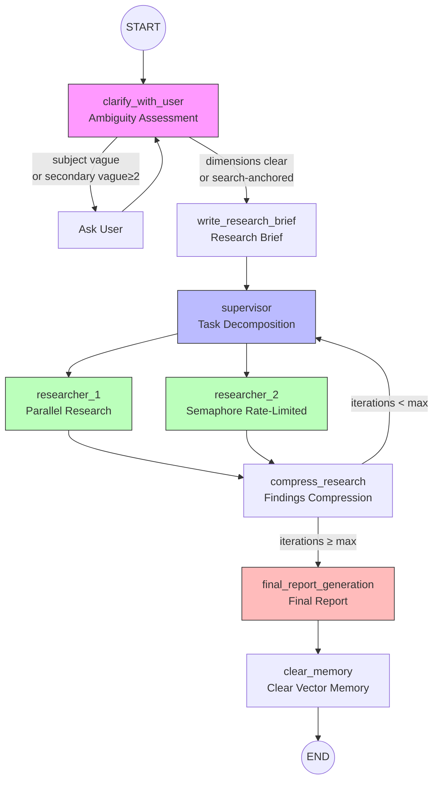

# 🔬 DeepClarity

**Pre-search anchored deep research agent with deterministic clarification and layered fault tolerance.**

Built on [open-deep-research](https://github.com/langchain-ai/open_deep_research). Key improvements:

- **Pre-search anchoring** — LLM generates queries and searches *before* deciding whether to ask the user, giving the decision real context instead of guessing
- **Five-dimension scoring + code rules** — subject/scope/audience/timeframe/search_anchored; code decides (not LLM), eliminating clarification dead loops
- **Layered fault tolerance** — assessment timeout degradation, per-query rate-limit tolerance, semaphore concurrency limiter
- **Runtime vector memory** — pages are embedded on fetch; researcher can recall previously-read content semantically via `recall_from_read_content`



**Core design principle: LLM scores, code decides.** LLM handles semantic understanding and text generation; all deterministic decisions (whether to ask, whether to continue, timeout fallback) are made by rule-based code.

Deep research has broken out as one of the most popular agent applications. This is a simple, configurable, fully open source deep research agent that works across many model providers, search tools, and MCP servers. It's performance is on par with many popular deep research agents ([see Deep Research Bench leaderboard](https://huggingface.co/spaces/Ayanami0730/DeepResearch-Leaderboard)).


### 🔥 Recent Updates

**August 14, 2025**: See our free course [here](https://academy.langchain.com/courses/deep-research-with-langgraph) (and course repo [here](https://github.com/langchain-ai/deep_research_from_scratch)) on building open deep research.

**August 7, 2025**: Added GPT-5 and updated the Deep Research Bench evaluation w/ GPT-5 results.

**August 2, 2025**: Achieved #6 ranking on the [Deep Research Bench Leaderboard](https://huggingface.co/spaces/Ayanami0730/DeepResearch-Leaderboard) with an overall score of 0.4344. 

**July 30, 2025**: Read about the evolution from our original implementations to the current version in our [blog post](https://rlancemartin.github.io/2025/07/30/bitter_lesson/).

**July 16, 2025**: Read more in our [blog](https://blog.langchain.com/open-deep-research/) and watch our [video](https://www.youtube.com/watch?v=agGiWUpxkhg) for a quick overview.

### 🚀 Quickstart

1. Clone the repository and activate a virtual environment:
```bash
git clone https://github.com/langchain-ai/open_deep_research.git
cd open_deep_research
uv venv
source .venv/bin/activate  # On Windows: .venv\Scripts\activate
```

2. Install dependencies:
```bash
uv sync
# or
uv pip install -r pyproject.toml
```

3. Set up your `.env` file to customize the environment variables (for model selection, search tools, and other configuration settings):
```bash
cp .env.example .env
```

4. Launch agent with the LangGraph server locally:

```bash
# Install dependencies and start the LangGraph server
uvx --refresh --from "langgraph-cli[inmem]" --with-editable . --python 3.11 langgraph dev --allow-blocking
```

This will open the LangGraph Studio UI in your browser.

```
- 🚀 API: http://127.0.0.1:2024
- 🎨 Studio UI: https://smith.langchain.com/studio/?baseUrl=http://127.0.0.1:2024
- 📚 API Docs: http://127.0.0.1:2024/docs
```

Ask a question in the `messages` input field and click `Submit`. Select different configuration in the "Manage Assistants" tab.

### ⚙️ Configurations

#### LLM :brain:

Open Deep Research supports a wide range of LLM providers via the [init_chat_model() API](https://python.langchain.com/docs/how_to/chat_models_universal_init/). It uses LLMs for a few different tasks. See the below model fields in the [configuration.py](https://github.com/langchain-ai/open_deep_research/blob/main/src/open_deep_research/configuration.py) file for more details. This can be accessed via the LangGraph Studio UI. 

- **Summarization** (default: `openai:gpt-4.1-mini`): Summarizes search API results
- **Research** (default: `openai:gpt-4.1`): Power the search agent
- **Compression** (default: `openai:gpt-4.1`): Compresses research findings
- **Final Report Model** (default: `openai:gpt-4.1`): Write the final report

> Note: the selected model will need to support [structured outputs](https://python.langchain.com/docs/integrations/chat/) and [tool calling](https://python.langchain.com/docs/how_to/tool_calling/).

> Note: For OpenRouter: Follow [this guide](https://github.com/langchain-ai/open_deep_research/issues/75#issuecomment-2811472408) and for local models via Ollama  see [setup instructions](https://github.com/langchain-ai/open_deep_research/issues/65#issuecomment-2743586318).

#### Search API :mag:

Open Deep Research supports a wide range of search tools. By default it uses the [Tavily](https://www.tavily.com/) search API. Has full MCP compatibility and work native web search for Anthropic and OpenAI. See the `search_api` and `mcp_config` fields in the [configuration.py](https://github.com/langchain-ai/open_deep_research/blob/main/src/open_deep_research/configuration.py) file for more details. This can be accessed via the LangGraph Studio UI. 

#### Other 

See the fields in the [configuration.py](https://github.com/langchain-ai/open_deep_research/blob/main/src/open_deep_research/configuration.py) for various other settings to customize the behavior of Open Deep Research. 

### 📊 Evaluation

Open Deep Research is configured for evaluation with [Deep Research Bench](https://huggingface.co/spaces/Ayanami0730/DeepResearch-Leaderboard). This benchmark has 100 PhD-level research tasks (50 English, 50 Chinese), crafted by domain experts across 22 fields (e.g., Science & Tech, Business & Finance) to mirror real-world deep-research needs. It has 2 evaluation metrics, but the leaderboard is based on the RACE score. This uses LLM-as-a-judge (Gemini) to evaluate research reports against a golden set of reports compiled by experts across a set of metrics.

#### Usage

> Warning: Running across the 100 examples can cost ~$20-$100 depending on the model selection.

The dataset is available on [LangSmith via this link](https://smith.langchain.com/public/c5e7a6ad-fdba-478c-88e6-3a388459ce8b/d). To kick off evaluation, run the following command:

```bash
# Run comprehensive evaluation on LangSmith datasets
python tests/run_evaluate.py
```

This will provide a link to a LangSmith experiment, which will have a name `YOUR_EXPERIMENT_NAME`. Once this is done, extract the results to a JSONL file that can be submitted to the Deep Research Bench.

```bash
python tests/extract_langsmith_data.py --project-name "YOUR_EXPERIMENT_NAME" --model-name "you-model-name" --dataset-name "deep_research_bench"
```

This creates `tests/expt_results/deep_research_bench_model-name.jsonl` with the required format. Move the generated JSONL file to a local clone of the Deep Research Bench repository and follow their [Quick Start guide](https://github.com/Ayanami0730/deep_research_bench?tab=readme-ov-file#quick-start) for evaluation submission.

#### Results 

| Name | Commit | Summarization | Research | Compression | Total Cost | Total Tokens | RACE Score | Experiment |
|------|--------|---------------|----------|-------------|------------|--------------|------------|------------|
| GPT-5 | [ca3951d](https://github.com/langchain-ai/open_deep_research/pull/168/commits) | openai:gpt-4.1-mini | openai:gpt-5 | openai:gpt-4.1 |  | 204,640,896 | 0.4943 | [Link](https://smith.langchain.com/o/ebbaf2eb-769b-4505-aca2-d11de10372a4/datasets/6e4766ca-613c-4bda-8bde-f64f0422bbf3/compare?selectedSessions=4d5941c8-69ce-4f3d-8b3e-e3c99dfbd4cc&baseline=undefined) |
| Defaults | [6532a41](https://github.com/langchain-ai/open_deep_research/commit/6532a4176a93cc9bb2102b3d825dcefa560c85d9) | openai:gpt-4.1-mini | openai:gpt-4.1 | openai:gpt-4.1 | $45.98 | 58,015,332 | 0.4309 | [Link](https://smith.langchain.com/o/ebbaf2eb-769b-4505-aca2-d11de10372a4/datasets/6e4766ca-6[…]ons=cf4355d7-6347-47e2-a774-484f290e79bc&baseline=undefined) |
| Claude Sonnet 4 | [f877ea9](https://github.com/langchain-ai/open_deep_research/pull/163/commits/f877ea93641680879c420ea991e998b47aab9bcc) | openai:gpt-4.1-mini | anthropic:claude-sonnet-4-20250514 | openai:gpt-4.1 | $187.09 | 138,917,050 | 0.4401 | [Link](https://smith.langchain.com/o/ebbaf2eb-769b-4505-aca2-d11de10372a4/datasets/6e4766ca-6[…]ons=04f6002d-6080-4759-bcf5-9a52e57449ea&baseline=undefined) |
| Deep Research Bench Submission | [c0a160b](https://github.com/langchain-ai/open_deep_research/commit/c0a160b57a9b5ecd4b8217c3811a14d8eff97f72) | openai:gpt-4.1-nano | openai:gpt-4.1 | openai:gpt-4.1 | $87.83 | 207,005,549 | 0.4344 | [Link](https://smith.langchain.com/o/ebbaf2eb-769b-4505-aca2-d11de10372a4/datasets/6e4766ca-6[…]ons=e6647f74-ad2f-4cb9-887e-acb38b5f73c0&baseline=undefined) |

### 🚀 Deployments and Usage

#### LangGraph Studio

Follow the [quickstart](#-quickstart) to start LangGraph server locally and test the agent out on LangGraph Studio.

#### Hosted deployment
 
You can easily deploy to [LangGraph Platform](https://langchain-ai.github.io/langgraph/concepts/#deployment-options). 

#### Open Agent Platform

Open Agent Platform (OAP) is a UI from which non-technical users can build and configure their own agents. OAP is great for allowing users to configure the Deep Researcher with different MCP tools and search APIs that are best suited to their needs and the problems that they want to solve.

We've deployed Open Deep Research to our public demo instance of OAP. All you need to do is add your API Keys, and you can test out the Deep Researcher for yourself! Try it out [here](https://oap.langchain.com)

You can also deploy your own instance of OAP, and make your own custom agents (like Deep Researcher) available on it to your users.
1. [Deploy Open Agent Platform](https://docs.oap.langchain.com/quickstart)
2. [Add Deep Researcher to OAP](https://docs.oap.langchain.com/setup/agents)

### Legacy Implementations 🏛️

The `src/legacy/` folder contains two earlier implementations that provide alternative approaches to automated research. They are less performant than the current implementation, but provide alternative ideas understanding the different approaches to deep research.

#### 1. Workflow Implementation (`legacy/graph.py`)
- **Plan-and-Execute**: Structured workflow with human-in-the-loop planning
- **Sequential Processing**: Creates sections one by one with reflection
- **Interactive Control**: Allows feedback and approval of report plans
- **Quality Focused**: Emphasizes accuracy through iterative refinement

#### 2. Multi-Agent Implementation (`legacy/multi_agent.py`)  
- **Supervisor-Researcher Architecture**: Coordinated multi-agent system
- **Parallel Processing**: Multiple researchers work simultaneously
- **Speed Optimized**: Faster report generation through concurrency
- **MCP Support**: Extensive Model Context Protocol integration

---

# 🔬 Open Deep Research 中文说明

### 🏗️ 架构

**核心设计原则：LLM 打分，代码决策。** LLM 负责语义理解和文本生成；所有确定性决策（是否提问、是否继续、超时兜底）均由基于规则的代码完成。

Open Deep Research 是一个简单、可配置、完全开源的深度研究智能体，支持多种模型提供商、搜索工具和 MCP 服务器。其性能与许多热门深度研究智能体持平（参见 [Deep Research Bench 排行榜](https://huggingface.co/spaces/Ayanami0730/DeepResearch-Leaderboard)）。

### 🚀 快速开始

1. 克隆仓库并激活虚拟环境：
```bash
git clone https://github.com/langchain-ai/open_deep_research.git
cd open_deep_research
uv venv
source .venv/bin/activate  # Windows: .venv\Scripts\activate
```

2. 安装依赖：
```bash
uv sync
# 或
uv pip install -r pyproject.toml
```

3. 配置 `.env` 文件，设置环境变量（模型选择、搜索工具等）：
```bash
cp .env.example .env
```

4. 启动 LangGraph 服务器：
```bash
uvx --refresh --from "langgraph-cli[inmem]" --with-editable . --python 3.11 langgraph dev --allow-blocking
```

启动后将在浏览器中打开 LangGraph Studio UI：

```
- 🚀 API: http://127.0.0.1:2024
- 🎨 Studio UI: https://smith.langchain.com/studio/?baseUrl=http://127.0.0.1:2024
- 📚 API 文档: http://127.0.0.1:2024/docs
```

在 `messages` 输入框中输入问题，点击 `Submit` 即可开始研究。可在 "Manage Assistants" 标签页中切换不同配置。

### ⚙️ 配置说明

#### LLM 模型 :brain:

通过 [init_chat_model() API](https://python.langchain.com/docs/how_to/chat_models_universal_init/) 支持多种 LLM 提供商。模型用于以下不同任务（详见 [configuration.py](https://github.com/langchain-ai/open_deep_research/blob/main/src/open_deep_research/configuration.py)）：

- **摘要模型**（默认：`openai:gpt-4.1-mini`）：对搜索结果进行摘要
- **研究模型**（默认：`openai:gpt-4.1`）：驱动搜索智能体
- **压缩模型**（默认：`openai:gpt-4.1`）：压缩研究发现
- **最终报告模型**（默认：`openai:gpt-4.1`）：撰写最终报告

> 注意：所选模型需要支持[结构化输出](https://python.langchain.com/docs/integrations/chat/)和[工具调用](https://python.langchain.com/docs/how_to/tool_calling/)。

> 注意：使用 OpenRouter 请参考[此指南](https://github.com/langchain-ai/open_deep_research/issues/75#issuecomment-2811472408)；使用 Ollama 本地模型请参考[安装说明](https://github.com/langchain-ai/open_deep_research/issues/65#issuecomment-2743586318)。

#### 搜索 API :mag:

默认使用 [Tavily](https://www.tavily.com/) 搜索 API。支持完整的 MCP 兼容性，以及 Anthropic 和 OpenAI 的原生网页搜索。详见 [configuration.py](https://github.com/langchain-ai/open_deep_research/blob/main/src/open_deep_research/configuration.py) 中的 `search_api` 和 `mcp_config` 字段。

#### 其他配置

详见 [configuration.py](https://github.com/langchain-ai/open_deep_research/blob/main/src/open_deep_research/configuration.py) 中的各字段，可自定义 Open Deep Research 的行为。

### 📊 评估

Open Deep Research 使用 [Deep Research Bench](https://huggingface.co/spaces/Ayanami0730/DeepResearch-Leaderboard) 进行评估。该基准包含 100 个博士级研究任务（50 个英文、50 个中文），由 22 个领域的专家设计。排行榜基于 RACE 评分，使用 LLM-as-a-judge（Gemini）对照专家编写的黄金标准报告进行评估。

#### 使用方法

> 警告：运行全部 100 个示例的费用约为 $20-$100，具体取决于模型选择。

```bash
# 在 LangSmith 数据集上运行评估
python tests/run_evaluate.py
```

运行完成后，将结果提取为可提交的 JSONL 文件：

```bash
python tests/extract_langsmith_data.py --project-name "你的实验名称" --model-name "你的模型名称" --dataset-name "deep_research_bench"
```

将生成的 JSONL 文件移动到本地克隆的 Deep Research Bench 仓库，按照其 [Quick Start 指南](https://github.com/Ayanami0730/deep_research_bench?tab=readme-ov-file#quick-start)提交评估。

### 🚀 部署与使用

#### LangGraph Studio

按照[快速开始](#-快速开始)部分启动本地 LangGraph 服务器，在 LangGraph Studio 中测试智能体。

#### 托管部署

可轻松部署到 [LangGraph Platform](https://langchain-ai.github.io/langgraph/concepts/#deployment-options)。

#### Open Agent Platform

Open Agent Platform（OAP）允许非技术用户构建和配置自己的智能体。我们已在公共演示实例上部署了 Open Deep Research，你只需添加 API 密钥即可试用：[点击这里](https://oap.langchain.com)。

### 🏛️ 历史实现

`src/legacy/` 文件夹包含两个早期实现，提供了不同的自动化研究方案：

#### 1. 工作流实现（`legacy/graph.py`）
- **规划-执行模式**：带人机交互规划的结构化工作流
- **顺序处理**：逐节生成报告并进行反思
- **交互式控制**：允许对报告计划进行反馈和审批

#### 2. 多智能体实现（`legacy/multi_agent.py`）
- **监督者-研究者架构**：协调的多智能体系统
- **并行处理**：多个研究者同时工作
- **MCP 支持**：广泛的模型上下文协议集成
