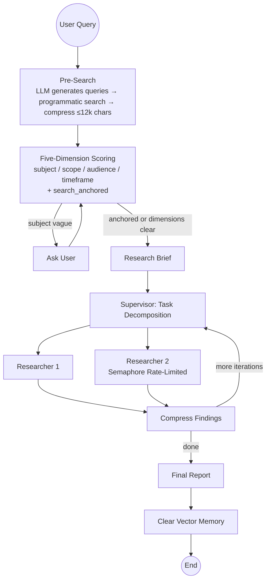

# 🔬 DeepClarity

**Pre-search anchored deep research agent with deterministic clarification and layered fault tolerance.**

> A deep research agent built for real-world network conditions. Core innovation: replaces upstream's LLM self-judgment (which causes clarification dead loops) with pre-search anchoring + five-dimension scoring + code-based decision rules. Layered fault tolerance ensures the system never hangs regardless of API failures.

---

## Core Design: LLM Scores, Code Decides



**Pre-search is not "search before research"** — it is the **fifth dimension of the clarification decision**. LLM generates 1-3 queries and searches programmatically; the compressed results become a boolean `search_anchored` (can the pre-search anchor the topic?), combined with four other dimensions (subject/scope/audience/timeframe) to feed deterministic rules. **Code decides whether to ask, not the LLM.**

## Key Improvements over Upstream open-deep-research

| Improvement | Upstream Problem | DeepClarity Solution |
|-------------|-----------------|---------------------|
| **Clarification judgment** | LLM self-decides → dead loops | Pre-search anchoring + 5-dim scoring + code rules + 3-round cap |
| **State persistence** | No checkpointer locally → forgets everything | `MemorySaver` for multi-turn persistence |
| **Rate-limit tolerance** | Silent failure on DDG limits | Pre-search retry + per-query research tolerance + worst-case degradation |
| **Assessment timeout** | LLM calls hang forever → silent UI | 60s timeout → proceed with assumptions |
| **Concurrency control** | Burst requests saturate search API | `max_concurrent_research_units` + `asyncio.Semaphore` |
| **Clarification convergence** | Re-asks on secondary dimensions after answer | Only re-asks if subject is still vague after user answered |
| **Vector memory** | Summary-only, no re-consultation | Embed on fetch; `recall_from_read_content` for semantic re-consultation |
| **Cost tracking** | None | In-process callback + cc-switch proxy-level logs |

See [docs/improvements-and-advantages.md](docs/improvements-and-advantages.md) for full details.

## Quick Start

```bash
git clone https://github.com/gj6khqpm6d-source/DeepClarity.git
cd DeepClarity
uv venv && source .venv/bin/activate
uv sync
```

Configure environment:
```bash
cp .env.example .env
# Edit .env: set model and search API
```

Launch local UI:
```bash
streamlit run app.py
```

Default: `deepseek:deepseek-chat` + DuckDuckGo. Recommended: switch to Tavily (free tier, 1000 queries/month):
```
SEARCH_API=tavily
TAVILY_API_KEY=your_key
```

## Five-Layer Evaluation Framework

| Layer | Score | Status |
|-------|-------|--------|
| 1. Task Completion | 40% | 100% report generation + termination guarantee; needs fixed regression set |
| 2. Output Quality | 30% | LLM-as-Judge infrastructure ready; 2 queries scored 4-5/5 |
| 3. Efficiency & Cost | 60% | Dual-layer tracking (in-process + cc-switch proxy) |
| 4. Robustness | **90%** | 6 fixes + fault injection testing; strongest layer |
| 5. Safety & Alignment | 10% | Vector memory has source tracing; prompt injection not tested |

See [docs/eval-framework.md](docs/eval-framework.md) | Results: [eval_results.json](eval_results.json)

## Project Structure

```
src/open_deep_research/
  deep_researcher.py    # Core graph: judgment / research / report
  configuration.py      # All config fields
  state.py              # State definitions + AmbiguityAssessment
  prompts.py            # System prompts
  utils.py              # Search tools + recall registration
  vector_memory.py      # Vector memory (fastembed + bge-small-zh)

app.py                  # Streamlit multi-turn chat UI
eval_fork.py            # Eval script (auto-pulls cc-switch costs)
cost_tracker.py         # In-process token tracking
docs/
  improvements-and-advantages.md  # Improvement record + competitive analysis
  eval-framework.md               # Five-layer evaluation framework
ISSUES.md               # Root cause / solution / verification / pitfalls for every fix
```

## Tech Stack

- **Framework**: LangGraph + LangChain
- **Models**: deepseek:deepseek-chat (swappable: OpenAI / Anthropic / Google / Groq)
- **Search**: Tavily (recommended) / DuckDuckGo / Native search / None
- **Vector Memory**: fastembed + BAAI/bge-small-zh-v1.5 (local, zero API cost)
- **Local Proxy**: cc-switch (tool_use format translation)
- **UI**: Streamlit

## License

MIT

---

# 🔬 DeepClarity（中文）

**预搜索锚定的防循环深度研究 Agent**

> 面向真实网络环境的深度研究智能体。核心改进:用"预搜索锚定 + 五维打分 + 代码决策"替代上游的"LLM 自判追问",彻底消除澄清死循环;六层容错确保任何故障下流程不挂起。

## 核心设计

**预搜索不是"研究前先搜一遍"**——它是**决策的第五维**:LLM 生成查询做程序化预搜,搜到的内容压缩后变成布尔值 `search_anchored`(能否锚定主题),与前四维(主题/边界/受众/时间范围)一起输入确定性规则,**代码决定问不问**,而非让 LLM 自判。

## 相对上游的改进

| 改进 | 上游问题 | DeepClarity 方案 |
|------|----------|-----------------|
| 澄清判断 | LLM 自判→死循环 | 预搜索锚定+五维打分+代码规则+3轮硬上限 |
| 状态持久化 | 本地无 checkpointer→失忆 | MemorySaver 多轮累积 |
| 搜索限流 | DDG 限流时静默失败 | 分层重试+单查询容错+最坏降级 |
| 评估超时 | LLM 调用无超时→静默挂起 | 60s 超时→按假设推进 |
| 并发控制 | 研究突发打满搜索 API | Semaphore 限流 |
| 追问收敛 | 次维度模糊每轮追问 | 已答后仅 subject 模糊才问 |
| 向量记忆 | 摘要即终点 | 边读边 embed,语义回看 |
| 成本追踪 | 无 | 双层追踪(进程内+cc-switch) |

## 快速开始

```bash
git clone https://github.com/gj6khqpm6d-source/DeepClarity.git
cd DeepClarity
uv venv && source .venv/bin/activate
uv sync
cp .env.example .env   # 编辑 .env 设置模型和搜索 API
streamlit run app.py   # 启动本地 UI
```

推荐切换到 Tavily(免费档 1000 次/月):
```
SEARCH_API=tavily
TAVILY_API_KEY=你的key
```

## 五层评估

| 层 | 评分 | 说明 |
|----|------|------|
| 1. 任务完成 | 40% | 100%出报告+终止保证;缺固定回归集 |
| 2. 输出质量 | 30% | LLM-as-Judge 基建到位;2查询4-5/5 |
| 3. 效率成本 | 60% | 双层追踪(进程内+cc-switch) |
| 4. 鲁棒性 | **90%** | 6修复+故障注入测试 |
| 5. 安全对齐 | 10% | 向量记忆有溯源;prompt injection 未做 |

详见 [docs/eval-framework.md](docs/eval-framework.md) | 评估数据:[eval_results.json](eval_results.json)

## License

MIT
