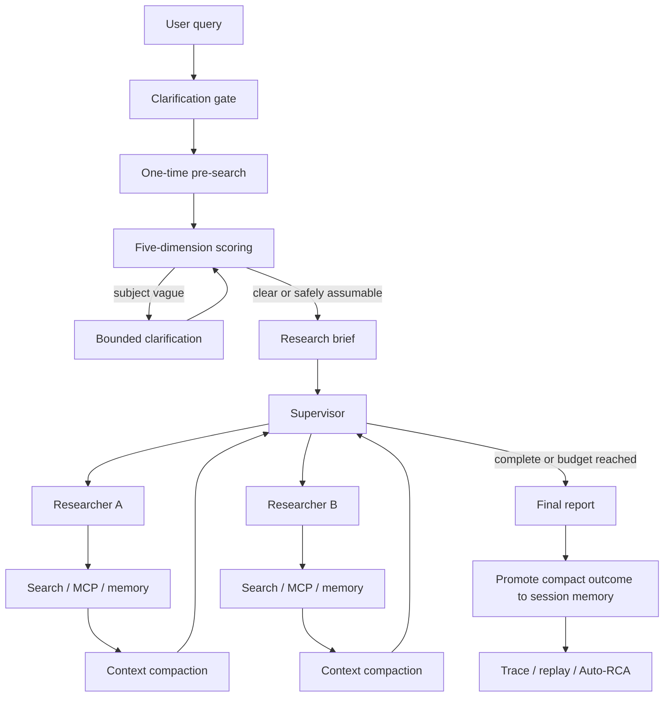

<div align="center">

<h1>DeepClarity</h1>

<h3>Build the runtime around the model—not just a prompt around the API.</h3>

<p>DeepClarity is a multi-turn deep-research agent runtime for bounded context, structured memory, task-aware tools, fault-tolerant orchestration, and replayable evaluation.</p>

<p><a href="README.zh-CN.md">简体中文</a> · <strong>English</strong></p>

<p>
  
  
  
  
</p>

<p><a href="#design-process">Design process</a> · <a href="#architecture">Architecture</a> · <a href="#quick-start">Quick start</a> · <a href="#evaluation-evidence">Evaluation</a> · <a href="#interview-walkthrough">Interview walkthrough</a></p>

</div>

---

<p align="center">
  
  <br />
  <sub>Workflow preview: clarification, parallel research, context control, and a cited report.</sub>
</p>

## Why this project

A deep-research agent is not only an LLM call. It must decide when to ask a question, coordinate tools and sub-agents, keep context within a budget, survive rate limits and timeouts, and provide evidence that can be inspected after a run.

DeepClarity is a local Streamlit fork of open-deep-research that treats those concerns as runtime components:

- deterministic clarification instead of an LLM-controlled question loop;
- a supervisor and bounded researcher loops;
- task/session memory with retrieve-then-load evidence;
- context editing and observation masking;
- cached, task-aware MCP tool selection;
- deadlines, retry budgets, concurrency limits, and partial-failure isolation;
- metadata-only telemetry, replay fixtures, and Auto-RCA;
- offline regression plus a deliberately small online pilot.

The project does not claim completed SFT, DPO, RLHF, or production-scale multilingual deployment. Those are future extensions, not hidden accomplishments.

## Design process

The implementation follows a failure-mode-first process.

### 1. Define runtime invariants

The runtime should:

1. terminate clarification;
2. preserve state across turns;
3. bound model, tool, context, retry, and concurrency budgets;
4. keep useful sibling work when one sub-agent fails;
5. recover precise evidence without injecting all old observations;
6. make latency, errors, and replay state inspectable without logging secrets.

### 2. Convert failure modes into policy

| Failure mode | Runtime policy | Implementation |
|---|---|---|
| Ambiguous requests cause repeated questions | LLM scores ambiguity; deterministic code decides | Pre-search anchoring + five-dimension rules |
| Search providers stall or rate-limit | Deadline, capped retry, per-query tolerance, fallback | Search utilities and graph nodes |
| Research history exceeds context budget | Mask old observations and retrieve evidence just in time | Context engine + vector memory |
| Large MCP inventories waste context | Cache inventory and bind task-relevant top-k tools | Tool registry and task-aware search |
| A researcher fails in parallel execution | Return a recoverable observation and keep successful siblings | Supervisor orchestration |
| A run is hard to reproduce | Record metadata-only events and replay tool behavior | Telemetry + ReplayEnvironment |

### 3. Separate model policy from runtime mechanism

The model proposes queries, scores ambiguity, decomposes research, and chooses tools. The runtime owns decisions that must remain bounded and auditable: whether to ask, when to stop, how much context to expose, how many retries to allow, and how much concurrency to permit.

> **The LLM scores and plans; code enforces budgets and termination.**

### 4. Verify in layers

- deterministic tests for rules, context, memory, safety, tool search, and replay;
- retrieval smoke evaluation;
- fake-tool timeout, rate-limit, authentication, injection, and concurrency tests;
- a three-task online pilot with two English and one Chinese task;
- judge calibration infrastructure with explicit evidence boundaries.

## Architecture



### Clarification gate

The first request can trigger one pre-search. The model generates 1–3 focused queries, the search tool returns evidence, and the result is compacted into bounded context. A structured model call scores subject, scope, audience, timeframe, and search anchoring.

Code then applies auditable rules: a vague subject must be clarified; multiple vague secondary dimensions require a question only when the topic is not anchored; a single missing dimension becomes an explicit assumption; and a hard clarification cap guarantees termination.

### Research, tools, context, and safety

The supervisor decomposes a brief into focused units. Independent units run concurrently within a configured budget. Each researcher runs a bounded model–tool loop, limits parallel tool calls with a semaphore, compresses evidence, and returns a concise result plus raw notes.

MCP endpoints are normalized into a multi-server inventory, cached, filtered by allowlists, and ranked locally against the task so only relevant tools are bound.

DeepClarity maintains two history views:

- **Replay state:** complete graph state and tool-call structure.
- **Model-facing context:** a bounded view with old observations masked when needed.

Evidence notes are deduplicated in task/session scopes. After a successful report, the compact outcome can be promoted to session memory while raw task evidence is cleared. Web, MCP, and memory text are treated as untrusted observations, and English/Chinese injection patterns are flagged.

## Features

| | Capability | What it demonstrates |
|:--:|---|---|
| 🧭 | **Deterministic clarification** | Pre-search anchoring, structured ambiguity scoring, code-enforced termination |
| 🧠 | **Context engineering** | Context budgets, observation masking, source-preserving compaction |
| 🗂️ | **Structured memory** | Task/session notes, deduplication, lifecycle promotion, JIT retrieval |
| 🧰 | **Tool runtime** | Multi-server MCP cache, task-aware top-k search, concurrency control |
| 🕸️ | **Multi-agent orchestration** | Supervisor decomposition, parallel researchers, bounded ReAct loops |
| 🛡️ | **Fault tolerance** | Deadlines, retries, rate-limit handling, partial-failure isolation |
| 📏 | **Evaluation** | Replay, fault injection, Auto-RCA, judge calibration, retrieval smoke tests |
| 📊 | **Telemetry** | Component duration, status, error category, context reduction, trace export |
| 💬 | **Local product surface** | Streamlit multi-turn chat with progress, report, and diagnostics |

## Quick start

Requirements: Python 3.11 and uv.

```bash
uv venv
source .venv/bin/activate
uv sync
```

Create .env from .env.example only if it does not already exist. For direct DeepSeek use:

```dotenv
RESEARCH_MODEL=deepseek:deepseek-chat
SUMMARIZATION_MODEL=deepseek:deepseek-chat
COMPRESSION_MODEL=deepseek:deepseek-chat
FINAL_REPORT_MODEL=deepseek:deepseek-chat
DEEPSEEK_API_KEY=your-key
SEARCH_API=duckduckgo
```

Launch the local UI:

```bash
streamlit run app.py
```

Open <http://127.0.0.1:8501>. The first live run can be slow because it includes multiple model/tool round trips and may download the local embedding model. The UI reports node-level progress; a complete online result is required before quoting latency or quality numbers.

## Evaluation evidence

| Layer | Current evidence | Boundary |
|---|---|---|
| Offline regression | Latest local run: 41 tests passed | Does not measure live model quality |
| Retrieval smoke test | 15 synthetic chunks and 10 labeled queries; Recall@5 and hit rate are emitted | Small regression fixture, not production traffic |
| Fault injection | 20 fake-tool cases; concurrency checked with 20 calls at levels 1, 2, and 4 | No real provider load test |
| Online pilot | Three versioned tasks: two English and one Chinese | No success/latency claim until a successful artifact is captured |
| Judge calibration | Exact agreement, weighted kappa, and Spearman metrics are implemented | Example labels are not human agreement evidence |
| Runtime signals | Model/tool duration, error status, context reduction, token callback | P50/P95 and cost need a larger controlled run |

Run deterministic checks:

```bash
python -m pytest -q
python eval_rag.py
python evals/calibrate_judge.py evals/human_judge_labels.example.json
python evals/run_fault_injection_v1.py
```

Run the online pilot only after configuring the API key:

```bash
python evals/run_pilot_v1.py
```

The pilot writes evals/runs/pilot-v1/pilot_v1_results.json. It is a current-version pilot, not an A/B comparison. Never turn a failed preflight or a three-task sample into a production success rate.

## Latency and interview trade-offs

The full quality path may be slow because it performs clarification/pre-search, brief generation, supervisor planning, researcher loops, compression, and final report generation. DeepSeek network latency and DuckDuckGo rate limits add variance.

For a live interview demo, use a bounded fast profile:

- disable clarification for a well-specified question;
- cap supervisor iterations at 2;
- cap researcher tool iterations at 2;
- allow at most 1 structured-output retry;
- use a fixed, narrow question;
- use replay fixtures when demonstrating orchestration rather than provider latency.

For production-oriented optimization, measure first, then consider query/result caching, faster routing models, parallel independent retrieval, adaptive early stopping, provider fallback, and token-aware context budgets.

## Interview walkthrough

A concise explanation is:

> I started from failure modes in a multi-turn research agent: clarification loops, unbounded observations, rate-limited tools, partial sub-agent failures, and poor reproducibility. I separated model proposals from runtime policy: the LLM scores and plans, while code enforces termination, deadlines, context budgets, concurrency, and fallback behavior. I then added task/session memory, observation masking with retrieve-then-load, cached task-aware MCP tool search, metadata-only telemetry, replay fixtures, and Auto-RCA. Finally, I separated offline regression from online quality evaluation so I do not confuse implemented infrastructure with measured product metrics.

Good demonstrations:

1. show the clarification rule and its termination test;
2. run fake-tool fault injection and inspect the trace;
3. submit one narrowly scoped question in the Streamlit UI;
4. show context masking or memory retrieval in a unit test;
5. explain why the current pilot is not enough to claim P50/P95 or judge–human agreement;
6. discuss quality-path versus fast-path latency and cost.

## Project structure

```text
app.py                              Streamlit UI and diagnostic trace download
src/open_deep_research/
  deep_researcher.py                LangGraph runtime and agent loops
  configuration.py                  Runtime budgets and provider settings
  state.py                          Graph state and structured judgments
  prompts.py                        Model instructions
  context_engine.py                 Context budgets, masking, trust boundaries
  vector_memory.py                  Task/session memory and JIT retrieval
  tool_registry.py                  MCP inventory, cache, and tool search
  utils.py                          Search providers and MCP integration
  telemetry.py                      Metadata-only runtime events
  cost_tracker.py                   In-process token/cost callbacks
  evaluation.py                     Replay, Auto-RCA, and judge calibration
evals/                              Versioned cases and pilot runners
tests/                              Network-free deterministic regression suite
docs/
  eval-framework.md                 Evaluation contract and evidence boundaries
  improvements-and-advantages.md    Detailed root-cause and design record
  interview-preparation-agent-runtime.md  Interview questions and study notes
ISSUES.md                           Root-cause, fix, verification, and pitfalls log
```

## Upstream and license

DeepClarity is built on open-deep-research and keeps its research workflow while adding local runtime, context, memory, tool, reliability, and evaluation layers.

See the upstream project for original attribution and [LICENSE](LICENSE) for license terms.

MIT

## Current scope

This repository is a local research and interview-ready runtime prototype. It demonstrates the engineering foundations needed for agent systems, but it is not evidence of post-training, large-scale multilingual rollout, or a closed-loop online policy optimizer. Those claims require separate datasets, controlled experiments, deployment infrastructure, and measured artifacts.
