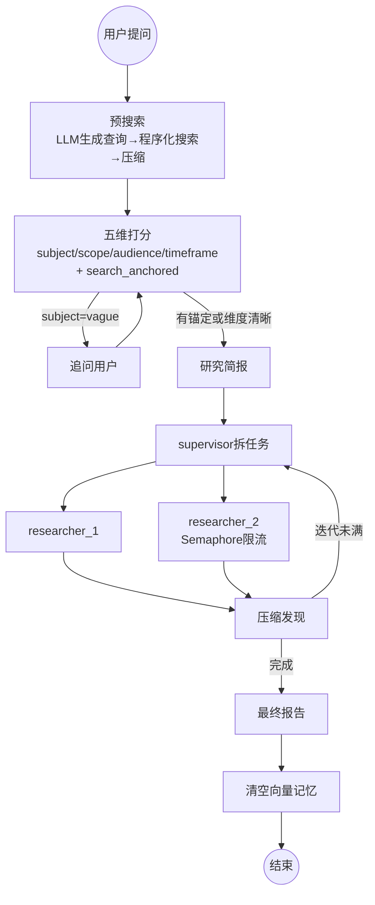

# 🔬 DeepClarity

**预搜索锚定的防循环深度研究 Agent**

> 面向真实网络环境的深度研究智能体。核心改进:用"预搜索锚定 + 五维打分 + 代码决策"替代上游的"LLM 自判追问",彻底消除澄清死循环;叠加六层容错确保任何故障下流程不挂起。

---

## 核心设计:LLM 打分,代码决策



**预搜索**不是"研究前先搜一遍"——它是**决策的第五维**:LLM 生成 1-3 条查询做程序化预搜,搜到的内容压缩后变成布尔值 `search_anchored`(预搜索能否锚定主题),与前四维(主题/边界/受众/时间范围)一起输入确定性规则,**代码决定问不问**,而非让 LLM 自判。

## 相对上游 open-deep-research 的改进

| 改进 | 上游问题 | DeepClarity 方案 |
|------|----------|-----------------|
| **澄清判断** | LLM 自判要不要问→死循环 | 预搜索锚定 + 五维打分 + 代码规则 + 3 轮硬上限 |
| **状态持久化** | 本地直调无 checkpointer→每轮失忆 | `MemorySaver` 多轮状态真实累积 |
| **搜索限流** | DDG 限流时静默失败 | 预搜索重试 + 研究单查询级容错 + 最坏降级 |
| **评估超时** | LLM 调用无超时→静默挂起 | 60s 超时→按假设推进 |
| **并发控制** | 研究突发打满搜索 API | `max_concurrent_research_units` + `asyncio.Semaphore` |
| **追问收敛** | 次维度模糊每轮追问 | 已答一轮后仅 subject 模糊才问 |
| **向量记忆** | 摘要即终点,无法回看原文 | 边读边 embed,`recall_from_read_content` 语义回看 |
| **成本追踪** | 无 | 进程内回调 + cc-switch 代理级日志 |

详见 [docs/improvements-and-advantages.md](docs/improvements-and-advantages.md)

## 快速开始

```bash
git clone https://github.com/gj6khqpm6d-source/DeepClarity.git
cd DeepClarity
uv venv && source .venv/bin/activate
uv sync
```

配置环境变量:
```bash
cp .env.example .env
# 编辑 .env,设置模型和搜索 API
```

启动本地 UI:
```bash
streamlit run app.py
```

默认使用 `deepseek:deepseek-chat` + DuckDuckGo。推荐切换到 Tavily(免费档 1000 次/月):
```
SEARCH_API=tavily
TAVILY_API_KEY=你的key
```

## 五层评估框架

| 层 | 评分 | 说明 |
|----|------|------|
| 1. 任务完成 | 40% | 100% 出报告 + 终止保证;缺固定回归集 |
| 2. 输出质量 | 30% | LLM-as-Judge 基建到位;2 查询 4-5/5 |
| 3. 效率成本 | 60% | 双层追踪(进程内+cc-switch) |
| 4. 鲁棒性 | **90%** | 6 修复 + 故障注入测试 |
| 5. 安全对齐 | 10% | 向量记忆有溯源;prompt injection 未做 |

详见 [docs/eval-framework.md](docs/eval-framework.md) | 评估数据见 [eval_results.json](eval_results.json)

## 项目结构

```
src/open_deep_research/
  deep_researcher.py    # 核心图:判断/研究/报告
  configuration.py      # 所有配置项
  state.py              # 状态定义 + AmbiguityAssessment
  prompts.py            # 系统提示词
  utils.py              # 搜索工具 + recall 注册
  vector_memory.py      # 向量记忆(fastembed + bge-small-zh)

app.py                  # Streamlit 多轮对话 UI
eval_fork.py            # 评估脚本(自动拉 cc-switch 成本)
cost_tracker.py         # 进程内 token 追踪
docs/
  improvements-and-advantages.md  # 改进记录 + 竞争优势
  eval-framework.md               # 五层评估框架
ISSUES.md               # 每个修复的根因/方案/验证/陷阱
```

## 技术栈

- **框架**:LangGraph + LangChain
- **模型**:deepseek:deepseek-chat(可换 OpenAI/Anthropic/Google/Groq)
- **搜索**:Tavily(推荐) / DuckDuckGo / 原生搜索 / 无搜索
- **向量记忆**:fastembed + BAAI/bge-small-zh-v1.5(本地,零 API 费)
- **本地代理**:cc-switch(支持 tool_use 格式转换)
- **UI**:Streamlit

## License

MIT
