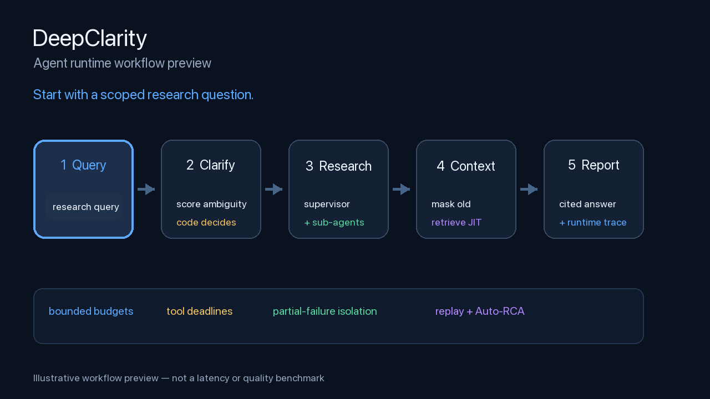
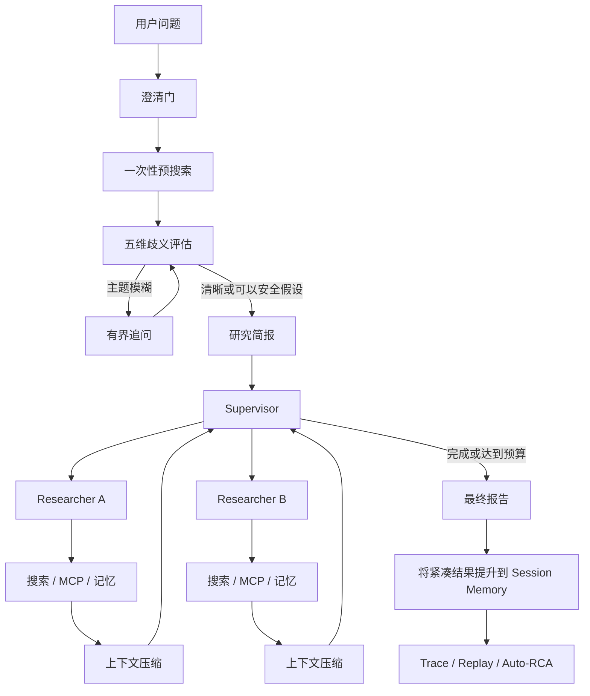

<div align="center">

<h1>DeepClarity</h1>

<h3>围绕模型构建 Runtime，而不是只围绕 API 写 Prompt。</h3>

<p>DeepClarity 是一个面向多轮深度研究的 Agent Runtime，重点覆盖上下文预算、结构化记忆、任务相关工具、容错编排和可回放评测。</p>

<p><strong>简体中文</strong> · <a href="README.md">English</a></p>

<p>
  
  
  
  
</p>

<p><a href="#设计过程">设计过程</a> · <a href="#系统架构">系统架构</a> · <a href="#快速开始">快速开始</a> · <a href="#评测证据">评测</a></p>

</div>

---

<p align="center">
  
  <br />
  <sub>工作流预览：有界澄清、并行研究、上下文控制和带引用报告。</sub>
</p>

## 项目定位

深度研究 Agent 不只是一次 LLM 调用。它需要判断什么时候提问，协调工具和子 Agent，在上下文预算内保留有效信息，处理限流和超时，并在运行后提供可检查的证据。

DeepClarity 是基于 open-deep-research 的本地 Streamlit fork，重点把这些能力实现为 Runtime 组件：

- 用确定性代码决策替代 LLM 自主追问循环；
- Supervisor + 有界 researcher loop；
- task/session 两级记忆和 retrieve-then-load；
- context editing 和 observation masking；
- 缓存、面向任务的 MCP 工具选择；
- deadline、重试预算、并发限制和局部失败隔离；
- metadata-only telemetry、replay fixture 和 Auto-RCA；
- 离线回归与小规模在线试跑。

项目没有声称已经完成 SFT、DPO、RLHF 或生产规模多语种部署；这些是后续扩展方向，不是已经完成的成果。

## 设计过程

项目采用“失败模式优先”的设计过程。

### 1. 定义 Runtime 不变量

Runtime 应该：

1. 保证澄清过程终止；
2. 支持多轮状态持久化；
3. 限制模型、工具、上下文、重试和并发预算；
4. 一个子 Agent 失败时保留其他成功结果；
5. 不把所有历史 observation 注入每次 Prompt，同时保留证据可恢复性；
6. 在不记录密钥和完整用户内容的情况下，让延迟、错误和回放状态可观测。

### 2. 把失败模式转化为策略

| 失败模式 | Runtime 策略 | 实现位置 |
|---|---|---|
| 问题模糊导致不断追问 | LLM 只打分，代码做决定 | 预搜索锚定 + 五维规则 |
| 搜索服务超时或限流 | deadline、有限重试、逐查询容错、降级 | 搜索工具和图节点 |
| 研究历史超过上下文预算 | 遮蔽旧 observation，需要时再检索 | Context Engine + Vector Memory |
| MCP 工具过多占用上下文 | 缓存 inventory，只绑定相关 top-k 工具 | Tool Registry |
| 并行研究中一个子 Agent 失败 | 返回可恢复 observation，保留成功兄弟任务 | Supervisor 编排 |
| 运行失败后无法复现 | 记录 metadata trace，重放工具行为 | Telemetry + ReplayEnvironment |

### 3. 分离模型策略和 Runtime 机制

模型负责生成 query、评估歧义、拆解研究任务和选择工具。Runtime 负责可审计、必须有边界的决策：是否追问、何时停止、暴露多少上下文、重试几次以及允许多少并发。

> **LLM 负责打分和规划，代码负责预算、终止和降级。**

### 4. 分层验证

- 规则、上下文、记忆、安全、工具搜索和 replay 的确定性单测；
- 检索 smoke test；
- fake tool 的 timeout、rate limit、auth、注入和并发测试；
- 三个任务的在线试跑，包括两个英文任务和一个中文任务；
- judge 校准基础设施，并明确示例标签不能当成人工一致率。

## 系统架构



### 澄清门

首轮问题可以触发一次预搜索。模型生成 1–3 条聚焦 query，程序化搜索工具返回证据，再压缩成有界上下文。结构化模型评估主题、范围、受众、时间范围以及搜索是否锚定主题。

随后由代码执行规则：主题模糊必须问；多个次要维度模糊且没有锚定时才问；单个缺失维度写成假设继续；澄清次数有硬上限，保证流程终止。

### 研究、工具、上下文和安全

Supervisor 把研究简报拆成多个聚焦任务。独立任务在配置的并发预算内并行执行。每个 researcher 使用有界的模型—工具循环，通过 semaphore 限制工具并发，压缩研究证据并返回摘要和原始笔记。

MCP endpoint 会被统一成多服务器 inventory，进行缓存、allowlist 过滤和基于任务的本地排序，只向 researcher 暴露相关工具。

DeepClarity 维护两种历史视图：

- **Replay State：** 完整图状态和工具调用结构；
- **Model-facing Context：** 在预算内向模型暴露的上下文，必要时遮蔽旧 observation。

证据笔记按 task/session 两级去重保存。报告成功后，可以将紧凑结果提升到 Session Memory，同时清理 task evidence。Web、MCP 和记忆文本都被视为不可信 observation，并检测中英文 Prompt Injection。

## 主要功能

| | 能力 | 展示的工程能力 |
|:--:|---|---|
| 🧭 | **确定性澄清** | 预搜索锚定、结构化歧义评分、代码保证终止 |
| 🧠 | **上下文工程** | 上下文预算、observation masking、保留来源结构的压缩 |
| 🗂️ | **结构化记忆** | task/session 证据笔记、去重、生命周期提升、JIT retrieval |
| 🧰 | **工具 Runtime** | 多服务器 MCP 缓存、任务相关 top-k 工具搜索、并发控制 |
| 🕸️ | **多 Agent 编排** | Supervisor 拆解、并行 researcher、有界 ReAct loop |
| 🛡️ | **容错机制** | deadline、重试、限流处理、局部失败隔离、优雅降级 |
| 📏 | **评测体系** | Replay、故障注入、Auto-RCA、judge 校准、检索 smoke test |
| 📊 | **可观测性** | 组件耗时、状态、错误类别、上下文压缩、可下载 trace |
| 💬 | **本地产品界面** | Streamlit 多轮对话、澄清、进度、报告和诊断信息 |

## 快速开始

要求：Python 3.11 和 uv。

```bash
uv venv
source .venv/bin/activate
uv sync
```

仅在当前没有 .env 时，从 .env.example 创建。直接使用 DeepSeek 时配置：

```dotenv
RESEARCH_MODEL=deepseek:deepseek-chat
SUMMARIZATION_MODEL=deepseek:deepseek-chat
COMPRESSION_MODEL=deepseek:deepseek-chat
FINAL_REPORT_MODEL=deepseek:deepseek-chat
DEEPSEEK_API_KEY=你的key
SEARCH_API=duckduckgo
```

启动本地网页：

```bash
streamlit run app.py
```

打开 <http://127.0.0.1:8501>。第一次真实运行可能较慢，因为包含多次模型/工具往返，而且本地 Embedding 模型可能需要先下载。页面展示节点级进度；没有成功在线 artifact 前，不应引用延迟或质量数字。

## 评测证据

| 层级 | 当前证据 | 边界 |
|---|---|---|
| 离线回归 | 最近一次本地运行：41 tests passed | 不代表真实模型回答质量 |
| 检索 smoke test | 15 个合成片段和 10 个标注查询，输出 Recall@5 与 hit rate | 小型回归夹具，不代表生产流量 |
| 故障注入 | 20 个 fake-tool 用例；并发 1、2、4 各执行 20 次 | 不是 Provider 负载测试 |
| 在线试跑 | 三个版本化任务：两个英文、一个中文 | 成功 artifact 生成前不宣称成功率或延迟 |
| Judge 校准 | 已实现 exact agreement、weighted kappa、Spearman 指标 | 示例标签不代表人工一致率 |
| Runtime 信号 | 模型/工具耗时、错误状态、上下文压缩、Token callback | P50/P95 和成本需要更大受控样本 |

运行确定性检查：

```bash
python -m pytest -q
python eval_rag.py
python evals/calibrate_judge.py evals/human_judge_labels.example.json
python evals/run_fault_injection_v1.py
```

配置 API Key 后再运行在线试跑：

```bash
python evals/run_pilot_v1.py
```

结果写入 evals/runs/pilot-v1/pilot_v1_results.json。它是当前版本的三任务试跑，不是 A/B 对照。不能把失败的 preflight 或三任务样本写成生产成功率。

## 延迟说明

完整质量路径可能较慢，因为包含澄清/预搜索、研究简报、Supervisor 规划、若干 researcher loop、压缩和最终报告。DeepSeek 网络延迟与 DuckDuckGo 限流也会造成波动。

生产优化应先测量再修改，可考虑 query/result cache、更快的小模型路由、独立检索并行、自适应提前停止、Provider fallback 和 token-aware context budget。

## 项目结构

```text
app.py                              Streamlit UI 和诊断 trace 下载
src/open_deep_research/
  deep_researcher.py                LangGraph Runtime 和 Agent loop
  configuration.py                  Runtime 预算和 Provider 配置
  state.py                          图状态和结构化判断
  prompts.py                        模型指令
  context_engine.py                 上下文预算、masking、信任边界
  vector_memory.py                  task/session 记忆和 JIT retrieval
  tool_registry.py                  MCP inventory、缓存和工具搜索
  utils.py                          搜索 Provider 和 MCP 集成
  telemetry.py                      metadata-only 运行事件
  cost_tracker.py                   进程内 Token/成本 callback
  evaluation.py                     Replay、Auto-RCA 和 judge 校准
evals/                              版本化用例和 pilot runner
tests/                              无网络确定性回归测试
docs/
  eval-framework.md                 评测契约和证据边界
  improvements-and-advantages.md    详细根因与设计记录
ISSUES.md                           根因、修复、验证和陷阱记录
```

## 上游与许可

DeepClarity 基于 open-deep-research，并保留其研究工作流，同时增加本地 Runtime、上下文、记忆、工具、可靠性和评测层。

上游归属信息见原项目，许可条款见 [LICENSE](LICENSE)。

MIT

## 当前范围

本仓库是一个本地研究 Runtime 原型。它展示了 Agent 系统所需的工程基础，但不是 SFT、DPO、RLHF、生产规模多语种上线或闭环在线策略优化的证据。上述能力需要独立数据集、受控实验、部署基础设施和版本化测量 artifact。
